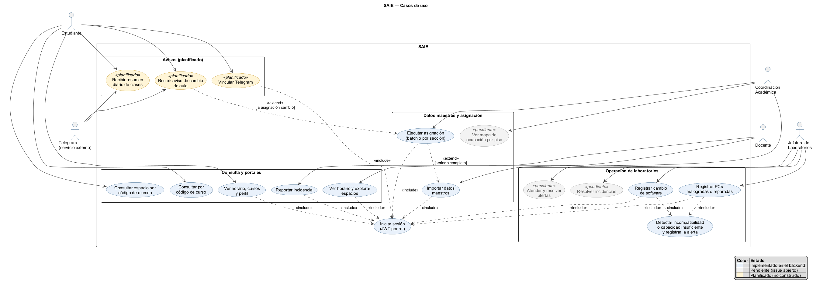
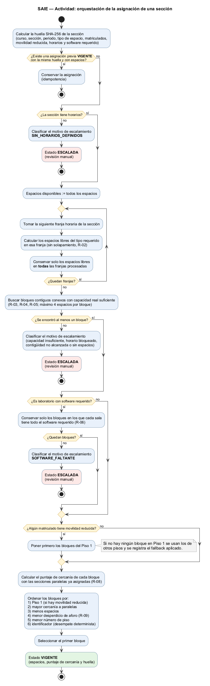

# Definición de Cada Tema y Cómo se Aplica en SAIE

> **Curso:** Automatización y Control de Software (202W0801) — UNMSM, Ingeniería de Software, 2026-2.
> **Qué es este documento:** para cada tema de las semanas 2 a 8, su definición, cómo se aplica en el proyecto SAIE y dónde se puede comprobar. Es la base de la presentación.
> **Registro asociado:** [`registro-cobertura.md`](registro-cobertura.md) lista los 45 temas con su estado.
> **Semanas 9 a 16:** [`definiciones-e-implementacion-semanas-9-16.md`](definiciones-e-implementacion-semanas-9-16.md).
> Cada tema cierra con **"Qué se podría mejorar"**.
> **Fecha:** 2026-10-07 · **Rama revisada:** `develop` más la rama `feature/1.6-endpoint-importacion`

## Estados

| Estado | Significado |
| :---: | :--- |
| **Aplicado** | El tema está en el proyecto (código, documento o artefacto). Se indica dónde. |
| **Planificado** | El tema se aplica con una funcionalidad diseñada, **todavía no construida** (§6). |
| **Justificado** | El tema se analizó y **no aplica** a SAIE; se explica por qué (§7). |

Resumen: **35 aplicados, 4 planificados y 6 justificados** (45 temas).

---

## 0. Procesos que SAIE automatiza

Un proceso se considera **automatizado** cuando, tras un disparo humano puntual (un clic, un archivo, un registro), el sistema ejecuta el resto sin intervención. Los siete procesos de SAIE están modelados en BPMN (`SAIE_Diagramas (2).pdf`).

| # | Proceso | Disparador | Lo que el sistema hace solo | Intervención humana | Estado en el código |
| :---: | :--- | :--- | :--- | :--- | :--- |
| 0 | Carga de datos maestros | Coordinación sube un CSV o JSON | Valida estructura y filas, persiste de forma idempotente, crea cuentas de alumnos y docentes, y dispara la asignación | Subir el archivo | Lógica y endpoint `POST /api/v1/import/:tipo` (rama `feature/1.6-endpoint-importacion`); pantalla pendiente (issue 1.9) |
| 0b | Gestión de espacios | Alta o edición de un espacio | Valida consistencia y guarda cambios con historial | Capturar los datos del espacio | **Semiautomático.** Gestión pendiente (issue 4.15); los 15 espacios se siembran por script |
| 1 | Asignación de espacios | Solicitud de asignación o importación completa | Calcula disponibilidad, capacidad real, bloque contiguo, software, accesibilidad y cercanía; asigna o escala con motivo; audita | Solo el disparo | **Implementado** |
| 2 | Consulta del estudiante | El alumno ingresa su código o el del curso | Busca y entrega espacio, horario y docente | Ingresar el código | **Implementado** (backend) |
| 3 | Alerta por software | Jefatura registra un cambio de software | Guarda el cambio con historial, compara el stack requerido y genera la alerta | Registrar el cambio | **Implementado**; falta listar y resolver alertas (issues 4.6 y 4.7) |
| 4 | Alerta por capacidad | Jefatura registra PCs malogradas o reparadas | Recalcula la capacidad real, revisa las asignaciones y genera la alerta | Registrar el cambio | **Implementado**; mismo faltante |
| 5 | Consulta visual de ocupación por piso | Coordinación abre el mapa | Arma el estado de cada espacio (disponible, ocupado, con alerta) | Abrir el mapa y elegir un espacio | Pendiente (issues 4.11 a 4.14) |

**Cuántos procesos se automatizan:**

* **7 procesos modelados.** **6 se automatizan** (0, 1, 2, 3, 4 y 5) y **1 es semiautomático** (0b: la captura es manual y solo la validación es automática).
* **Ya funcionan en el backend: 4** (1, 2, 3 y 4), más el 0 en la rama del endpoint de importación.
* Con el aviso por Telegram y el resumen diario (§6) se sumarían **2 procesos más**: **9 procesos, 8 automatizados.**

Los procesos 1, 3 y 4 son los de mayor valor: sustituyen una decisión que antes se tomaba a mano.

---

## 1. Semanas 2–3: Introducción a la automatización y control de software

### 1.1. Concepto de automatización — Aplicado

**Definición.** Automatizar es hacer que un sistema ejecute una tarea o tome una decisión sin intervención humana una vez disparado. Se distingue de la simple informatización: no solo registra datos, sino que *ejecuta* el trabajo.

**En SAIE.** La asignación de aulas y laboratorios, que antes se armaba a mano, la decide el motor de reglas. Coordinación pulsa un solo disparador y el motor evalúa capacidad real, disponibilidad horaria, contigüidad, software, accesibilidad y cercanía entre secciones paralelas, hasta persistir o escalar cada sección. El principio de diseño es *"automatización de decisión, no de infraestructura"*: se automatiza lo que se decide, no el servidor.

**Evidencia.** `docs/arquitectura.md` §2.2; `backend/src/rules/orquestadorAsignacion.ts`, `corridaBatch.ts`.

**Qué se podría mejorar.** Hoy cada proceso aún necesita al menos un disparo humano. El encadenado completo (importar, asignar y avisar) sin pasos intermedios se logra con el endpoint de importación (#248) y el bus de eventos (#249). Además, cuando aparece una alerta el sistema avisa pero no propone qué sección reubicar.

### 1.2. Concepto de control — Aplicado

**Definición.** Controlar es medir el resultado de un proceso, compararlo con lo esperado y corregir o avisar cuando se desvía. Un control necesita tres cosas: una referencia, una medición y una acción correctiva.

**En SAIE el control se ejerce en tres lugares:**

| Dónde | Referencia | Medición | Acción ante la desviación |
| :--- | :--- | :--- | :--- |
| Controles (*gates*) del motor | Reglas duras R-01 a R-06 | Cada bloque candidato | Descarta el bloque; si ninguno cumple, escala con el motivo (R-10) |
| Detección de alertas | Stack de software y capacidad requeridos por cada asignación vigente | Estado actual del laboratorio | Registra una alerta `SOFTWARE` o `CAPACIDAD` |
| Pipeline CI/CD | Pruebas, linter y formato | Resultado de cada chequeo | Bloquea el despliegue si algo falla |

**Evidencia.** `backend/src/rules/`; `backend/src/services/deteccionAlertas.service.ts`; `.github/workflows/ci.yml`.

**Qué se podría mejorar.** El control actúa solo cuando alguien registra un cambio por el endpoint: si un dato cambia por otra vía, nadie lo detecta. Una revisión periódica (temporizador) cerraría ese hueco. Tampoco se verifica de forma continua que se cumplan las métricas de éxito del proyecto.

### 1.3. Automatización versus control — Aplicado

**Definición.** La automatización *ejecuta*; el control *verifica y corrige*. Un sistema puede automatizar sin controlar (ejecuta a ciegas) o controlar sin automatizar (una persona mide y decide).

| | Automatización | Control |
| :--- | :--- | :--- |
| Qué hace en SAIE | Asigna espacios a todas las secciones del periodo | Revisa que lo asignado siga siendo válido cuando el entorno cambia |
| Cuándo | Cuando Coordinación dispara la corrida o se completa una importación | Cuando Jefatura registra un cambio de software o de PCs |
| Resultado | Asignación `VIGENTE` o `ESCALADA` | Alerta `SOFTWARE` o `CAPACIDAD` |
| Código | `ejecutarCorridaBatch`, `orquestarAsignacionSeccion` | `detectarIncompatibilidadesSoftware`, `detectarCapacidadInsuficiente` |

La asignación se decide una vez; el control vigila que esa decisión siga siendo correcta.

**Qué se podría mejorar.** La detección vive dentro de los servicios de laboratorio; separarla como una capa de control explícita, suscrita a eventos, haría visible la distinción. Falta medir la tasa de escalamiento por corrida como indicador de control.

### 1.4. Sistemas automatizados y sistemas controlados — Aplicado

**Definición.** El sílabo distingue cinco tipos de sistema. **Manual:** una persona ejecuta y decide. **Automatizado:** ejecuta tareas sin intervención tras un disparo. **Controlado:** además mide y corrige o avisa. **Embebido:** software dentro de un dispositivo físico dedicado. **Inteligente:** decide con técnicas de IA o aprendizaje.

| Tipo | ¿SAIE? | Justificación |
| :--- | :---: | :--- |
| Manual | No | Es el estado previo que SAIE reemplaza. |
| Automatizado | **Sí** | Motor de asignación e importadores. |
| Controlado | **Sí** | Detección de alertas sobre asignaciones vigentes. |
| Embebido | No | Es una aplicación web; no corre dentro de hardware dedicado. |
| Inteligente | No (en sentido estricto) | Decide con reglas deterministas y explicables (D-05), sin aprendizaje automático. |

SAIE es un **sistema automatizado y controlado, basado en reglas**.

**Qué se podría mejorar.** Hacer visible el carácter "controlado" con un panel de estado (alertas, secciones escaladas, última corrida). Hoy esa información solo se consulta directamente en la base de datos.

### 1.5. Entrada → proceso → decisión → acción → retroalimentación — Aplicado

**Definición.** Ciclo básico de un sistema de control: recibe una entrada, la procesa, decide, actúa y devuelve información sobre el resultado.

| Proceso | Entrada | Proceso | Decisión | Acción | Retroalimentación |
| :--- | :--- | :--- | :--- | :--- | :--- |
| Asignación (BPMN 1) | Secciones, horarios, matrículas, espacios | Filtrado y búsqueda de bloque contiguo | ¿Existe un bloque válido? ¿Cumple la capacidad final? | Persistir `VIGENTE` o marcar `ESCALADA` | `motivo_escalamiento` y registro de auditoría |
| Alerta por software (BPMN 3) | Cambio de software de un laboratorio | Comparar stack requerido con el instalado | ¿Hay incompatibilidades? | Crear alerta `SOFTWARE` | Alerta `PENDIENTE` e historial del cambio |
| Alerta por capacidad (BPMN 4) | PCs malogradas o reparadas | Recalcular capacidad real | ¿La capacidad queda bajo los matriculados? | Crear alerta `CAPACIDAD` | Idem |
| Consulta (BPMN 2) | Código de alumno o de curso | Buscar asignación | ¿El código existe? | Mostrar el resultado o "código inexistente" | Ninguna hacia el sistema |
| Carga de datos (BPMN 0) | Archivo CSV o JSON | Validar y persistir | ¿Hay filas rechazadas? ¿El periodo está completo? | Informar el reporte y, si corresponde, disparar la asignación | Reporte de filas aceptadas y rechazadas |

**Qué se podría mejorar.** La retroalimentación se queda en la base de datos: ni el operador ni el alumno la reciben si no consultan. El panel de alertas (issues 4.9 y 4.10) y los avisos por Telegram (#252) harían que llegue.

### 1.6. Lazo abierto y lazo cerrado — Aplicado

**Definición.** En un **lazo abierto** la salida no vuelve a influir en la entrada. En un **lazo cerrado** el resultado se mide y se realimenta al proceso para corregirlo.

| Proceso | Lazo | Justificación |
| :--- | :---: | :--- |
| Alertas por software y capacidad | **Cerrado** | La alerta vuelve al operador, que corrige el laboratorio y vuelve a registrar el cambio; el sistema reevalúa. Una alerta pendiente idéntica se actualiza en lugar de duplicarse (`registrarAlerta`). |
| Asignación con escalamiento | **Cerrado** | Una sección sin bloque válido queda `ESCALADA` con su motivo; al corregir datos y volver a correr el proceso, el motor la reevalúa. |
| Consulta del estudiante | **Abierto** | Entrega un dato; nada vuelve al sistema. |
| Carga de datos maestros | **Abierto** | Valida y carga, pero no mide si el resultado coincide con lo esperado en el mundo real. |

**Matiz.** El lazo de SAIE es cerrado *con una persona en el lazo*: el sistema detecta y avisa, pero la corrección la hace Jefatura o Coordinación. Hoy están implementados la detección y el registro de la alerta; listarla y resolverla (issues 4.6 y 4.7) está pendiente.

**Qué se podría mejorar.** Listar y resolver alertas (issues 4.6 y 4.7) aún no existe, así que el lazo depende de que Jefatura vuelva a registrar el cambio. Falta también reevaluar automáticamente las asignaciones al resolver una alerta.

### 1.7. Sistemas físicos versus procesos de software — Aplicado

**Definición.** En un sistema físico (un termostato) el control actúa sobre una magnitud medida por sensores, de forma continua. En un proceso de software lo controlado son datos y decisiones, y el control actúa por eventos.

| Elemento | Sistema físico (termostato) | SAIE |
| :--- | :--- | :--- |
| Magnitud controlada | Temperatura | Validez de las asignaciones vigentes |
| Sensor | Termómetro | Registros de Jefatura (software instalado, PCs malogradas) |
| Referencia | Temperatura deseada | Reglas duras R-01 a R-06 |
| Actuador | Calefactor | Registro de alerta y reasignación |
| Corrección | Continua | Discreta, por evento |

**Qué se podría mejorar.** Es un tema conceptual. La mejora sería reemplazar el "sensor" manual (el registro de Jefatura) por una lectura automática del estado de las PCs; ver IoT en el documento de las semanas 9 a 16.

### 1.8. Casos de aplicación en Ingeniería de Software — Aplicado

**Definición.** Ejemplos donde la automatización y el control se aplican al propio ciclo de desarrollo y operación de software.

**En SAIE.** El pipeline del proyecto: integración continua en cada pull request (linter, formato y más de 390 pruebas unitarias y parametrizadas), puerta de calidad antes de desplegar, migraciones de base de datos automáticas y despliegue a Vercel, Render y Supabase tras fusionar en `develop`. Se tratará con más detalle en la Unidad 4 del sílabo.

**Evidencia.** `.github/workflows/ci.yml`, `.github/workflows/cd.yml`; `README.md` §9.

**Qué se podría mejorar.** Cerrar las brechas del propio pipeline: compilación en el CI, cobertura y SonarCloud, un E2E real y una verificación posterior al despliegue. Ver los hallazgos H1 a H9 en `registro-cobertura-semanas-9-16.md`.

---

## 2. Semana 4: Eventos, condiciones y reglas de control

### 2.1. Concepto de evento — Aplicado

**Definición.** Un evento es un hecho identificable que ocurre en un instante y que puede disparar una decisión automática. Un evento *informa* que algo pasó; la reacción es otra cosa.

**En SAIE.** Los eventos son las acciones puntuales de los actores (subir un archivo, pedir una asignación, registrar un cambio en un laboratorio, reportar una incidencia) y los hechos que produce el propio sistema (una sección queda escalada, una asignación deja de cumplir un requisito). Los que se registran tienen tipo propio: `ASIGNACION`, `ESCALAMIENTO` y `ALERTA` (`TipoEventoAuditoria` en `backend/prisma/schema.prisma`).

**Qué se podría mejorar.** Los eventos no son objetos explícitos: viven como llamadas dentro de los servicios, y el tipo `ALERTA` de auditoría existe pero no se registra. El bus de eventos (#249) los haría explícitos.

### 2.2. Fuentes de eventos — Aplicado

**Definición.** La *fuente* es quién o qué origina el evento: una persona, un componente del sistema, otro sistema o el paso del tiempo.

| Fuente | Eventos que origina |
| :--- | :--- |
| Coordinación Académica | Subir un archivo; pedir una asignación |
| Jefatura de Laboratorios | Cambio de software; PCs malogradas o reparadas |
| Docente | Reporte de incidencia |
| Motor de asignación | Sección escalada; asignación cambiada |
| Detección de alertas | Una asignación vigente deja de cumplir un requisito |
| El tiempo (planificado) | Vence el intervalo del resumen diario (§6) |

**Qué se podría mejorar.** La auditoría no guarda quién originó el evento (`RegistroAuditoria` no tiene cuenta). Agregar la cuenta y la fuente (persona, sistema o tiempo).

### 2.3. Eventos internos y externos — Aplicado

**Definición.** Un evento es **externo** si lo origina un actor fuera del sistema, e **interno** si lo origina el propio sistema.

| Evento | Tipo |
| :--- | :---: |
| Se sube un archivo CSV o JSON | Externo |
| Se solicita una asignación (batch o por sección) | Externo |
| Se registra un cambio de software o de PCs | Externo |
| Un docente reporta una incidencia | Externo |
| Una sección no tiene bloque válido | Interno |
| Una asignación vigente deja de cumplir un requisito | Interno |
| La importación termina y el periodo está completo | Interno |

Hoy los eventos internos se resuelven como llamadas directas entre servicios dentro de la misma transacción. El bus de eventos del §6 los convertiría en mensajes.

**Qué se podría mejorar.** Los eventos internos son llamadas directas dentro de una transacción; no se puede agregar una reacción sin modificar al emisor. El bus de eventos lo resuelve.

### 2.4. Modelo Evento–Condición–Acción (ECA) — Aplicado

**Definición.** Una regla ECA dice: *cuando ocurre un evento, si se cumple una condición, se ejecuta una acción.* Separa qué dispara la regla, qué debe cumplirse y qué se hace.

| Evento | Condición | Acción | Dónde | Estado |
| :--- | :--- | :--- | :--- | :---: |
| Solicitud de asignación | Sección con matrículas y horarios | Ejecutar el motor; persistir y auditar | `motor.service.ts` | Aplicado |
| Ningún candidato cumple las reglas duras | Siempre | Marcar `ESCALADA` con el motivo (R-10) | `escalamiento.ts` | Aplicado |
| Cambio de software | Una asignación vigente pierde el stack requerido | Crear alerta `SOFTWARE` | `laboratorio.service.ts` | Aplicado |
| Cambio de PCs malogradas | La capacidad real queda bajo los matriculados | Crear alerta `CAPACIDAD` | `laboratorio.service.ts` | Aplicado |
| Importación sin filas rechazadas | El periodo ya tiene secciones, horarios y matrículas | Ejecutar la corrida de asignación | `importacion.service.ts` | Aplicado (rama del endpoint) |
| Reporte de incidencia | Cuenta con rol docente | Registrar la incidencia | `docente.controller.ts` | Aplicado |
| Asignación cambiada | El alumno tiene Telegram vinculado | Enviar el aviso | — | Planificado (§6) |
| Alerta creada | Siempre | Registrar auditoría de tipo `ALERTA` | — | Planificado (§6) |
| Vence el intervalo diario | El alumno tiene clase ese día | Enviar el resumen de clases | — | Planificado (§6) |

**Qué se podría mejorar.** Las reglas ECA están dispersas en el código; solo la tabla de triggers de `docs/arquitectura.md` §7 las documenta, sin columna de condición. Incorporar la tabla ECA a la arquitectura (issue 6.13) y mantenerla junto al código.

### 2.5. Reglas de negocio — Aplicado

**Definición.** Políticas de la organización expresadas como condiciones verificables. Se distinguen de la lógica técnica porque las define el negocio y pueden cambiar sin cambiar la arquitectura.

**En SAIE.** R-01 a R-11 (`docs/03_alcance_y_reglas.md` §2). **Duras** (descartan candidatos): tipo homogéneo, disponibilidad horaria, capacidad real, fraccionamiento mínimo, contigüidad, software, escalamiento explicable y una asignación activa. **Blandas** (solo ordenan): accesibilidad, cercanía entre paralelas y menor desperdicio.

**Evidencia.** `backend/src/rules/` (`calcularCapacidadReal.ts`, `buscarBloqueContiguo.ts`, `validarSoftware.ts`, `accesibilidad.ts`, `cercaniaParalelas.ts`); pruebas en `backend/tests/unit/rules/`.

**Qué se podría mejorar.** Hay una discrepancia entre R-07 y RF-10 y el código: la documentación habla de elegir el espacio "más cercano al ascensor" (`Espacio.distancia_ascensor`), pero ese campo no existe y el código solo prioriza el Piso 1, con alternativa a otros pisos. Alinear una u otra (hallazgo H6).

### 2.6. Condiciones y decisiones automáticas — Aplicado

**Definición.** Evaluar condiciones y elegir una acción sin intervención humana. En un sistema automatizado las decisiones deben ser repetibles y explicables.

**En SAIE.** `orquestarAsignacionSeccion` decide entre asignar y escalar; `clasificarMotivoEscalamiento` determina qué regla eliminó a los últimos candidatos; las funciones de detección deciden si una asignación vigente queda afectada. El motor es **determinista** (D-05) y usa una huella de entrada (`calcularHuellaEntradaSeccion`) para conservar asignaciones cuyos datos no cambiaron.

**Qué se podría mejorar.** El motor limita los bloques a 4 espacios por defecto (`maxEspaciosPorBloque`), un tope que no aparece en las reglas documentadas. Documentarlo o hacerlo configurable, y medir cuántas secciones se escalan por ese tope.

### 2.7. Triggers — Aplicado

**Definición.** Un trigger es el disparador que inicia un proceso automático: una acción de un usuario, un evento del sistema o una condición de tiempo.

| Trigger | Endpoint | Quién |
| :--- | :--- | :--- |
| Carga de datos maestros | `POST /api/v1/import/:tipo` | Coordinación Académica |
| Asignación de todo el periodo | `POST /api/v1/asignaciones/batch` | Coordinación Académica |
| Asignación de una sección | `POST /api/v1/asignaciones/seccion/:id` | Coordinación Académica |
| Cambio de software de un laboratorio | `POST /api/v1/admin/laboratorios/:id/software` | Coordinación o Jefatura |
| Cambio de PCs malogradas | `POST /api/v1/admin/laboratorios/:id/pcs-malogradas` | Coordinación o Jefatura |
| Reporte de incidencia | `POST /api/v1/docente/incidencias` | Docente |

El endpoint de importación está en la rama `feature/1.6-endpoint-importacion`.

**Qué se podría mejorar.** La importación ya tiene endpoint (#248) pero no pantalla (issue 1.9). Faltan protecciones: no hay límite de intentos de inicio de sesión (H8) ni limitación de frecuencia en los endpoints que disparan procesos costosos. El candado de corrida está en memoria, válido solo con una instancia.

### 2.8. Casos de automatización basados en eventos — Aplicado

**Caso 1: alerta por cambio de software** (BPMN 3).

1. **Evento:** Jefatura registra el nuevo software de un laboratorio (`registrarCambioSoftware`).
2. En **una sola transacción**: verifica que la cuenta tenga acceso a ese laboratorio, guarda el software, deja una fila en `HistorialEspacio` (valor anterior, nuevo, fecha y cuenta) y evalúa las asignaciones vigentes del laboratorio.
3. **Condición:** si el stack requerido de alguna sección ya no está completo, hay afectadas.
4. **Acción:** `registrarAlertaDesdeDeteccion` persiste una alerta `SOFTWARE` en estado `PENDIENTE` con un motivo que nombra los cursos y grupos afectados; si ya existe una idéntica, la actualiza.
5. Si el cambio no modifica nada, no se registra cambio ni alerta.

El caso de **capacidad** (BPMN 4) es análogo y además rechaza un conteo de PCs malogradas mayor al aforo nominal.

**Caso 2: importación que dispara la asignación** (BPMN 0). Una carga sin filas rechazadas, con el periodo ya completo, dispara la corrida batch. Está detallado en el §3.10.

**Qué se podría mejorar.** La alerta se guarda pero no notifica a nadie: la lectura y la resolución están pendientes (issues 4.6 y 4.7) y la notificación está planificada (#252). Registrar además la auditoría del evento de alerta (issue 5.11).

---

## 3. Semanas 5–6: Diseño de soluciones de automatización y control

### 3.1. Identificación del problema — Aplicado

**Definición.** Describir qué falla hoy, a quién afecta y con qué consecuencia, antes de proponer una solución.

**En SAIE** (`.md/01_definicion_y_alcance.md` §1): la asignación de espacios no cruza la matrícula con la capacidad real; los cursos grandes terminan fraccionados en espacios separados; se asignan laboratorios sin el software requerido; no se prioriza la accesibilidad; y el estudiante no sabe dónde le toca clase.

**Qué se podría mejorar.** Falta una línea base cuantitativa del problema (cuántos conflictos o reclamos había con el proceso manual); sin ella no se puede demostrar la mejora.

### 3.2. Procesos susceptibles de automatización — Aplicado

**Definición.** Los procesos candidatos a automatizar son repetitivos, se rigen por reglas claras, manejan datos estructurados y consumen tiempo humano.

**En SAIE.** Se automatizaron la asignación de espacios, la detección de alertas, la consulta y la carga de datos. Los siete procesos y su grado de automatización están en el §0.

**Qué se podría mejorar.** Agregar el BPMN del estado actual (*as-is*) junto al de SAIE (*to-be*) para mostrar qué pasos se eliminan.

### 3.3. Definición de objetivos — Aplicado

**Definición.** Qué se quiere lograr y cómo se medirá.

**En SAIE.** Objetivo (§2 de la definición): automatizar la asignación de espacios con un motor único de reglas, un portal de consulta y un panel de alertas, con pruebas automatizadas y CI/CD. Métricas (§8): 0 casos de doble reserva, 0 de capacidad insuficiente, 100 % de software cumplido, 0 incidentes de accesibilidad y cobertura ≥ 85 %.

**Qué se podría mejorar.** Las métricas de éxito (0 doble reserva, 0 capacidad insuficiente, 100 % de software) no se verifican automáticamente. Una consulta o prueba que las compruebe tras cada corrida las convertiría en evidencia.

### 3.4. Requisitos funcionales — Aplicado

**Definición.** Lo que el sistema debe hacer.

**En SAIE.** RF-01 a RF-24 (`docs/02_requisitos.md`): importación, cuentas y autenticación, motor de asignación, consulta, portal docente, alertas y auditoría. Cada uno se traza a una historia de usuario (`docs/01_historias_usuario.md`).

**Qué se podría mejorar.** RF-14 (asignación manual de secciones escaladas) contradice la definición del proyecto, que la excluye; resolver la contradicción. Completar también los requisitos sin implementación visible (mapa, ruta).

### 3.5. Requisitos no funcionales — Aplicado

**Definición.** Las cualidades que debe cumplir el sistema: rendimiento, seguridad, usabilidad, etc.

**En SAIE.** RNF-01 a RNF-10: latencia p95 < 2 s con 300 usuarios, error < 1 %, uso desde móvil, claves con bcrypt y control por rol, cobertura ≥ 85 %, idempotencia, trazabilidad, explicabilidad, privacidad de la ficha médica y mantenibilidad.

**Qué se podría mejorar.** RNF-01 y RNF-02 (300 usuarios, p95 < 2 s, error < 1 %) no se han probado: el k6 actual es un humo de `/api/health` (H4). RNF-05 (cobertura ≥ 85 %) no se hace cumplir (H3).

### 3.6. Identificación de entradas y salidas — Aplicado

**Definición.** Qué datos recibe cada proceso y qué entrega.

| Proceso | Entradas | Salidas |
| :--- | :--- | :--- |
| Carga de datos maestros | CSV o JSON de cursos y secciones, horarios, matrículas o docentes | Registros persistidos; reporte de filas aceptadas y rechazadas; cuentas con clave provisoria; resumen de asignación si corresponde |
| Asignación de espacio | Sección, matriculados, horarios, espacios, contigüidad, software, PCs malogradas, flag de movilidad reducida | Asignación `VIGENTE` o `ESCALADA`; espacios asociados; auditoría |
| Detección de alertas | Cambio de software o de PCs; asignaciones vigentes | Alerta `SOFTWARE` o `CAPACIDAD` con las asignaciones afectadas; historial |
| Consulta del estudiante | Código de alumno o de curso | Espacio, pabellón, piso, horario y docente (sin ficha médica, RNF-09) |
| Reporte de incidencia | Espacio, descripción, docente autenticado | Incidencia registrada |

**Qué se podría mejorar.** Las entradas y salidas viven en tablas de texto y en DTOs de TypeScript. Un contrato formal (OpenAPI o esquemas Zod compartidos) evitaría que se desalineen, como ya ocurrió con la spec de importación.

### 3.7. Eventos, reglas, decisiones y acciones — Aplicado

**Definición.** Los cuatro elementos que describen el comportamiento de un proceso automatizado: qué lo dispara, qué lo gobierna, qué se decide y qué se ejecuta.

**En SAIE.** Eventos (§2.2 y §2.3), reglas (R-01 a R-11), decisiones (§2.6) y acciones (tabla ECA del §2.4). El orden de evaluación del motor está en `docs/03_alcance_y_reglas.md` §2.3.

**Qué se podría mejorar.** El orden de evaluación documentado (`docs/03_alcance_y_reglas.md` §2.3) no coincide del todo con el del código: "menos espacios" y "menor piso" aparecen solo en el código. Actualizar la documentación.

### 3.8. Casos de uso — Aplicado

**Definición.** Un caso de uso describe una interacción entre un actor y el sistema para lograr un objetivo observable.

| Actor | Caso de uso | Cómo se realiza | Estado |
| :--- | :--- | :--- | :--- |
| Estudiante | Consultar su espacio por código de alumno | `GET /api/v1/consulta/alumno/:codigoAlumno` (público, D-04) | Backend listo |
| Estudiante | Consultar por código de curso | `GET /api/v1/consulta/curso/:codigoCurso` | Backend listo |
| Estudiante | Ver horario, cursos y perfil | `GET /api/v1/estudiante/horario`, `/cursos`, `/perfil` | Backend listo |
| Docente | Ver horario y explorar espacios | `GET /api/v1/docente/horario`, `/espacios/explorador` | Backend listo |
| Docente | Reportar incidencia | `POST /api/v1/docente/incidencias` | Backend listo |
| Coordinación | Importar datos maestros | `POST /api/v1/import/:tipo` | Backend listo (rama del endpoint); pantalla pendiente |
| Coordinación | Ejecutar asignación batch o por sección | `POST /api/v1/asignaciones/batch` y `/seccion/:id` | Backend listo |
| Jefatura / Coordinación | Registrar cambio de software o de PCs | `POST /api/v1/admin/laboratorios/:id/software` y `/pcs-malogradas` | Backend listo |
| Jefatura | Atender y resolver alertas | — | Pendiente (issues 4.6 y 4.7) |
| Jefatura | Resolver incidencias | — | Pendiente (issue 7.6) |
| Coordinación | Ver el mapa de ocupación | — | Pendiente (issues 4.11 a 4.14) |
| Estudiante | Recibir avisos de cambio de aula por Telegram | — | Planificado (§6) |

**Diagrama UML** (código PlantUML en [`diagramas/casos-de-uso.puml`](diagramas/casos-de-uso.puml)): cuatro actores del sistema más Telegram como servicio externo, 16 casos de uso agrupados por módulo, relaciones `<<include>>` (inicio de sesión; detección de alertas) y `<<extend>>` (la asignación extiende la importación cuando el periodo está completo). Los colores distinguen lo implementado, lo pendiente y lo planificado.

**Qué se podría mejorar.** Cada caso de uso tiene solo su endpoint y su estado; falta su especificación (precondiciones, flujo básico y flujos alternos). Actualizar la tabla y el diagrama cuando se construyan las pantallas.

### 3.9. Diagramas de actividad (UML) y BPMN — Aplicado

**Definición.** Los **diagramas de actividad** (UML) modelan el flujo de un proceso: acciones, decisiones y bifurcaciones. **BPMN** modela procesos de negocio con carriles por actor, eventos de inicio y fin, tareas y compuertas, y está pensado para que lo lea tanto el negocio como el equipo técnico.

**En SAIE.** Siete diagramas BPMN con carriles (`SAIE_Diagramas (2).pdf`): carga de datos maestros (0), gestión de espacios (0b), asignación (1), consulta del estudiante (2), alerta por software (3), alerta por capacidad (4) y ocupación por piso (5). Cada carril es un actor (Coordinación, Jefatura, Estudiante, Sistema). Los BPMN modelan los **procesos de negocio**. Además se incluye un **diagrama UML de actividad** que modela otro nivel: el **algoritmo interno** con el que el motor asigna una sección (`orquestarAsignacionSeccion`, `backend/src/rules/orquestadorAsignacion.ts`), con sus puntos de escalamiento, el ciclo sobre las franjas horarias y los seis criterios de ordenamiento. Código PlantUML en [`diagramas/actividad-orquestacion-asignacion.puml`](diagramas/actividad-orquestacion-asignacion.puml).

**Qué se podría mejorar.** Los BPMN están fuera del repositorio; versionarlos junto al código. Agregar los de los procesos 6 y 7 (issue 6.13) y las rutas de error (por ejemplo, filas rechazadas), que hoy no se dibujan.

### 3.10. Diseño de la arquitectura de la solución — Aplicado

**Definición.** La estructura de componentes, capas, seguridad y flujo de datos que sostiene los requisitos, incluidas las decisiones técnicas que la justifican.

**En SAIE** (`docs/arquitectura.md`): API REST en Express con capas de rutas, controladores, servicios y reglas; Prisma sobre PostgreSQL (Supabase); autenticación JWT con cuatro roles y control por rol (`authGuard` y `roleGuard`); frontend React; despliegue en Vercel y Render. El motor es único para aulas y laboratorios (`Espacio.tipo` como discriminador).

**Flujo de la importación encadenada** (rama `feature/1.6-endpoint-importacion`):

1. Coordinación envía el archivo a `POST /api/v1/import/:tipo` (solo ese rol; se autentica antes de leer el cuerpo).
2. `archivoImportacion.ts` lee el CSV (separador `,` o `;`, con o sin BOM) o el JSON, y convierte booleanos, listas y días de la semana al formato que esperan los esquemas Zod.
3. El importador valida cada fila, guarda de forma idempotente y reporta las rechazadas.
4. Si no hubo filas rechazadas y el periodo vigente ya tiene secciones, horarios y matrículas, `importacion.service.ts` dispara la corrida batch; si faltan datos, informa cuáles; si hay una corrida en curso, lo informa. La importación nunca se pierde por un fallo del motor.

**Qué se podría mejorar.** El diagrama de arquitectura es ASCII; un diagrama C4 o PlantUML sería más mantenible. Documentar las decisiones (por qué reglas y no IA, por qué un solo motor). Limitaciones por documentar: el candado y el bus en memoria no escalan a varias instancias; no hay limitación de frecuencia ni cabeceras de seguridad (`helmet`); el contrato de la API que la línea base de diseño prevé aún no existe.

### 3.11. Formulación del proyecto del curso — Aplicado

**Definición.** Delimitar qué entra y qué no entra en el proyecto, con decisiones justificadas.

**En SAIE.** Alcance del MVP y exclusiones justificadas (`docs/03_alcance_y_reglas.md`), decisiones D-01 a D-05, plan de línea base con control de cambios (`docs/04_plan_linea_base.md`) y acta de aprobación (`docs/acta-lb-funcional-01.md`).

**Qué se podría mejorar.** La línea base funcional nunca se formalizó (no hay tags ni acta firmada). Cerrar el acta LB-F-01 y aplicar el control de cambios desde entonces.

---

## 4. Semana 6: APIs e integración de sistemas

### 4.1. Integración de aplicaciones — Aplicado

**Definición.** Conectar aplicaciones para que intercambien datos o funciones, ya sea por archivos, API, mensajería o base de datos compartida.

**En SAIE** se integran tres aplicaciones desplegadas por separado:

| Componente | Plataforma | Se comunica con |
| :--- | :--- | :--- |
| Frontend (React) | Vercel | Backend, por HTTPS con Axios y JWT |
| Backend (Express) | Render | Base de datos, mediante Prisma |
| Base de datos (PostgreSQL) | Supabase | Backend, con pooler y conexión directa para migraciones |

El despliegue de las tres está automatizado (`cd.yml`). Con los **sistemas externos** la integración es **por archivo**: los datos del sistema de matrícula entran como CSV por el endpoint de importación. Es una decisión de alcance (`docs/03_alcance_y_reglas.md` §3.2). La integración con Telegram (§6) sería la primera con un servicio externo mediante API.

**Qué se podría mejorar.** La primera integración externa (Telegram) debe tratar sus fallos: reintentos, tiempos de espera y desvinculación si el alumno bloquea el bot. Documentar todos los puntos de integración en un solo lugar.

### 4.2. Concepto de API — Aplicado

**Definición.** Una API es una interfaz que expone funciones de un sistema a otros mediante un contrato (rutas, parámetros, respuestas y errores).

**En SAIE.** API REST bajo `/api/v1`, con JWT y control por rol (`backend/src/routes/`):

| Grupo | Endpoint | Rol requerido |
| :--- | :--- | :--- |
| Autenticación | `POST /auth/admin/login`, `/auth/alumno/login`, `/auth/docente/login` | Público |
| Consulta pública | `GET /consulta/alumno/:codigoAlumno`, `/consulta/curso/:codigoCurso` | Público |
| Estudiante | `GET /estudiante/horario`, `/cursos`, `/perfil`; `PATCH /estudiante/perfil` | Alumno |
| Docente | `GET /docente/horario`, `/docente/espacios/explorador`; `POST /docente/incidencias` | Docente |
| Administración | `POST /admin/laboratorios/:id/software`, `/pcs-malogradas` | Coordinación o Jefatura (Jefatura solo en sus laboratorios) |
| Asignación | `POST /asignaciones/batch`, `/asignaciones/seccion/:id` | Coordinación |
| Importación | `POST /import/:tipo` (`cursos-secciones`, `horarios`, `matriculas`, `docentes`) | Coordinación |
| Salud | `GET /api/health` | Público |

Los errores usan un formato uniforme `{ success: false, message }` y nunca exponen el detalle interno. Los datos de salud del alumno solo se entregan en su propio perfil autenticado (RNF-09). No hay contrato OpenAPI; el sílabo no lo exige.

**Qué se podría mejorar.** No hay contrato OpenAPI. Faltan paginación en los listados y limitación de frecuencia; el inicio de sesión hoy no limita intentos (H8).

---

## 5. Semana 7: automatización de tareas y datos (aplicada por API)

Los cinco temas siguientes pertenecen al bloque de RPA del sílabo, pero son conceptos generales de automatización. SAIE los aplica **por API**, no con un bot de interfaz.

### 5.1. Automatización de tareas repetitivas — Aplicado

**Definición.** Tareas rutinarias, con reglas claras y alto volumen, que una máquina puede ejecutar mejor y más rápido que una persona.

**En SAIE.** Dos tareas repetitivas que se hacían a mano: cargar los datos de cada periodo (cursos, horarios, matrículas, docentes) y asignar cientos de secciones. Los importadores y la corrida batch las ejecutan por API, con idempotencia (repetirlas no duplica nada).

**Qué se podría mejorar.** Las importaciones procesan fila por fila con varias consultas cada una; 20 000 filas pueden tardar minutos. Procesar por lotes y dentro de una transacción mejoraría la velocidad y evitaría guardados parciales.

### 5.2. Manipulación de datos — Aplicado

**Definición.** Leer, transformar, validar y almacenar datos durante una tarea automatizada.

**En SAIE.** El endpoint de importación lee CSV o JSON, detecta el separador, quita el BOM, convierte texto a booleanos y listas, normaliza los días con tilde, valida cada fila con esquemas Zod y guarda con `upsert`. Una fila inválida se reporta con su número y motivo sin detener las demás.

**Evidencia.** `backend/src/lib/archivoImportacion.ts`; `backend/src/importers/`.

**Qué se podría mejorar.** Las filas válidas se guardan aunque otras fallen, contra lo que piden los issues 1.3 a 1.5 (rechazar el archivo completo). Decidir una política (todo o nada, o parcial documentado) y probarla.

### 5.3. Control de flujo — Aplicado

**Definición.** Condicionales, bucles y reintentos que determinan qué se hace según el resultado de cada paso.

**En SAIE.** El flujo de importación decide según el resultado: si hubo filas rechazadas no dispara la asignación; si el periodo está incompleto informa qué falta; si hay una corrida en curso lo informa en lugar de lanzar otra; si el motor falla, la importación ya guardada se conserva. El motor decide entre asignar y escalar.

**Qué se podría mejorar.** El candado de corrida está en memoria y no sirve con varias instancias del backend; uno en la base de datos (*advisory lock*) lo resolvería. Los reintentos son manuales.

### 5.4. Reglas y excepciones — Aplicado

**Definición.** Las reglas gobiernan el camino normal; las excepciones son los casos que lo salen de él y necesitan un tratamiento definido.

| Excepción | Tratamiento en SAIE |
| :--- | :--- |
| Fila inválida en un archivo | Se reporta con número de fila y motivo; las demás se procesan |
| Archivo vacío, CSV o JSON mal formado | Responde 400 con un mensaje claro |
| Archivo demasiado grande | Responde 413 |
| Sección sin bloque válido | Queda `ESCALADA` con el motivo (R-10) |
| Dos corridas simultáneas | La segunda responde 409 (candado en memoria) |
| Importación repetida | No duplica datos (idempotencia, RNF-06) |
| Error interno | Se registra solo el tipo de error; no se devuelve el detalle (RNF-09) |

**Qué se podría mejorar.** Los errores de fila son texto libre; un código de error estructurado por tipo permitiría que el frontend muestre mensajes propios y agrupe los errores.

### 5.5. Diseño de un flujo automatizado — Aplicado

**Definición.** Modelar el flujo completo de una automatización con una notación formal: pasos, decisiones, responsables y finales.

**En SAIE.** Los BPMN 0 (carga de datos maestros) y 1 (asignación de espacios) modelan los dos flujos automatizados principales, con sus compuertas ("¿Validación correcta?", "¿Importación completa?", "¿Existe bloque válido?", "¿Cumple capacidad real final?") y sus finales (datos cargados, sin corrida automática, revisión manual).

**Qué se podría mejorar.** Los BPMN 0 y 1 muestran el camino normal y varios finales, pero no las excepciones (archivo inválido, corrida en curso, fallo del motor) que el código sí trata.

---

## 6. Diseño planificado: aviso de cambio de aula por Telegram (4 temas)

> **Estado: planificado. No existe en el código.** Este apartado define los cuatro temas y el diseño con el que SAIE los aplicaría. Requiere registrar el cambio de alcance (las notificaciones están excluidas en `docs/03_alcance_y_reglas.md` §3.2) y seguir el control de cambios de la línea base.

### 6.1. Sistemas orientados a eventos — Planificado

**Definición.** Arquitectura en la que los componentes se comunican emitiendo y escuchando eventos, en lugar de llamarse directamente. El emisor no sabe quién reaccionará; eso reduce el acoplamiento y permite agregar reacciones sin tocar al emisor.

**En SAIE.** Hoy el motor, las alertas y la auditoría se llaman directamente. Se propone un **bus de eventos interno** (`EventEmitter` de Node): el motor emite `asignacion.cambiada` y la detección emite `alerta.creada`; los suscriptores reaccionan. Es una versión ligera, dentro del mismo proceso, apropiada para el tamaño del sistema. Los eventos se emitirían **después de confirmar la transacción**, para no avisar de algo que luego se revierte.

**Qué se podría mejorar.** Un `EventEmitter` no cruza procesos: con más de una instancia habría que pasar a una cola (por ejemplo, Redis). Documentar ese límite.

### 6.2. Programación orientada a eventos — Planificado

**Definición.** Estilo de programación en el que el flujo lo determinan eventos y sus manejadores (*handlers*), no una secuencia fija de llamadas.

**En SAIE.** Dos manejadores suscritos al bus:

| Evento | Manejador | Efecto |
| :--- | :--- | :--- |
| `asignacion.cambiada` | Notificador de Telegram | Avisa a los alumnos matriculados que tengan Telegram vinculado |
| `alerta.creada` | Auditoría de alertas | Registra una fila `ALERTA` en `RegistroAuditoria`, hoy ausente (issue 5.11) |

**Qué se podría mejorar.** Los manejadores deben ser idempotentes (un aviso no debe repetirse si el evento se emite dos veces) y registrar su resultado.

### 6.3. Temporizadores — Planificado

**Definición.** Disparadores basados en el paso del tiempo: un intervalo, una hora fija o un vencimiento.

**En SAIE.** Un **resumen diario** de clases a primera hora: "Hoy tienes INF101 en el laboratorio L-201 a las 08:00". Un temporizador evita depender de que alguien dispare el aviso. En Render gratuito el contenedor se suspende tras 15 minutos sin tráfico, por lo que no conviene un temporizador interno; se dispararía desde fuera con una tarea programada (`schedule`) de GitHub Actions que llame a un endpoint protegido.

**Qué se podría mejorar.** Vigilar que la tarea programada realmente corrió y alertar si no lo hizo; hoy un fallo silencioso de la tarea pasaría desapercibido.

### 6.4. Bots de software — Planificado

**Definición.** Programas que ejecutan tareas de forma autónoma o conversan con usuarios. Un *chatbot* responde a mensajes; un bot de RPA opera interfaces (ver §7).

**En SAIE.** Un bot de Telegram que avisa al alumno cuando cambia el aula de un curso suyo. La Bot API de Telegram es gratuita. El bot no puede escribir a un número de teléfono: solo a quien lo inició antes.

**Vinculación (una sola vez, hecha por el alumno):**

1. El alumno abre el bot y pulsa `/start`.
2. Se identifica con su código y su clave de SAIE (verificada contra su cuenta, con bcrypt). No basta el código: la consulta por código es pública (D-04) y cualquiera podría suscribirse a los avisos de otro.
3. El sistema guarda el `chat_id` asociado al alumno (requiere una tabla nueva y una migración).
4. El alumno puede darse de baja con un comando.

**Aviso (automático desde entonces):**

1. Una corrida de asignación cambia los espacios de una sección que ya tenía asignación `VIGENTE`.
2. El motor emite `asignacion.cambiada`.
3. El notificador busca a los matriculados con `chat_id` y les envía: curso, sección, aula anterior, aula nueva y horario. **Nunca** datos de la ficha médica (RNF-09).

**Excepciones:** si el alumno bloqueó el bot, Telegram responde con error; se desvincula y se registra. Los envíos fallidos se reintentan un número limitado de veces.

**Procesos nuevos (§0):** 6, aviso de cambio de aula, y 7, resumen diario.

**Qué se podría mejorar.** Además de avisar, el bot podría responder a comandos (`/horario`, `/aula`) reutilizando los endpoints de consulta. Agregar también un límite de intentos de vinculación.

---

## 7. RPA: análisis y justificación (6 temas)

> **Conclusión: RPA no aplica a SAIE.** RPA se usa cuando un sistema no ofrece API y solo puede operarse a través de su interfaz. SAIE tiene API propia, y todos sus procesos se automatizan por ella. Esta sección define cada tema y muestra el análisis que sostiene la conclusión.

### 7.1. Introducción a RPA — Justificado

**Definición.** La Automatización Robótica de Procesos (RPA) usa *bots* que imitan las acciones de una persona sobre las interfaces de usuario de otras aplicaciones (clics, escritura, copiar y pegar) para ejecutar tareas repetitivas, sin modificar los sistemas subyacentes. Su valor está en integrar sistemas que no ofrecen una API.

**En SAIE.** No se usa. El sistema se integra por API y por archivo, que son más estables que operar una pantalla.

**Qué se podría mejorar.** Si el equipo obtuviera acceso a un sistema institucional sin API, reevaluar RPA con el análisis del §7.2.

### 7.2. Procesos candidatos a RPA — Justificado

**Definición.** Un proceso es buen candidato cuando es repetitivo, está basado en reglas claras, usa datos estructurados, tiene volumen alto, la interfaz es estable y **no hay API disponible**. El último criterio es el decisivo: si hay API, se prefiere.

| Proceso de SAIE | Repetitivo | Reglas claras | Datos estructurados | Sin API disponible | ¿Candidato? |
| :--- | :---: | :---: | :---: | :---: | :---: |
| Carga de datos maestros | Sí | Sí | Sí (CSV) | **No**: tiene endpoint propio | No |
| Asignación de espacios | Sí | Sí | Sí | **No**: tiene API y motor | No (además es una decisión, no una tarea de interfaz) |
| Alertas por software y capacidad | Sí | Sí | Sí | **No**: se disparan por API | No |
| Consulta del estudiante | Sí | Sí | Sí | **No**: API pública | No |
| Gestión de espacios | No (baja frecuencia) | Sí | Sí | **No** | No |
| Aviso de cambio de aula | Sí | Sí | Sí | **No**: Telegram ofrece API | No |

Ningún proceso cumple el criterio decisivo. El único borde es el **origen** de los datos: el sistema de matrícula de la universidad solo entrega archivos exportados a mano. Un bot que operara ese portal sería un candidato real, pero ese sistema está fuera del alcance del proyecto, no se tiene acceso a él y no habría cómo probarlo.

**Qué se podría mejorar.** Mantener la tabla de candidatos actualizada si cambia el contexto (por ejemplo, acceso al portal de matrícula).

### 7.3. Automatización de interfaces — Justificado

**Definición.** El bot reproduce la operación de una persona sobre una pantalla: iniciar sesión, completar campos, pulsar botones, leer resultados. Se apoya en herramientas como Selenium o Playwright, o en plataformas de RPA.

**En SAIE.** No hay una interfaz ajena que operar. La única automatización de interfaz del proyecto es Playwright en las pruebas end-to-end (`tests/e2e/`), que verifica el sistema, no ejecuta procesos de negocio.

**Qué se podría mejorar.** Playwright ya está en el stack, pero hoy se usa solo en una prueba que comprueba una plantilla de otro proyecto (H1). Aprovecharlo para flujos E2E reales.

### 7.4. Automatización atendida y desatendida — Justificado

**Definición.** La **atendida** trabaja junto a una persona y se dispara desde su escritorio; la asiste en una tarea. La **desatendida** corre sola, en un servidor y programada, sin intervención.

**En SAIE.** Si hubiera un bot, sería **desatendido** (la carga de un periodo es periódica y no necesita decisión humana). Lo más cercano que tiene el sistema es desatendido: la corrida de asignación y el resumen diario planificado (§6.3). No se construye un bot.

**Qué se podría mejorar.** No aplica; si hubiera un bot, la modalidad desatendida sería la adecuada.

### 7.5. Ventajas y limitaciones de RPA — Justificado

| | Ventajas | Limitaciones |
| :--- | :--- | :--- |
| En general | Rapidez de implementación; no modifica los sistemas existentes; reduce errores de captura; libera tiempo humano | Frágil ante cambios de interfaz; mantenimiento continuo; difícil de probar; depende del rendimiento de la pantalla; riesgo de seguridad al manejar credenciales |
| Frente a SAIE | Habría evitado el desarrollo de importadores si no existiera API | SAIE ya tiene la API: es más estable, se prueba con pruebas automatizadas (más de 390) y no depende de pantallas |

**Aplicación.** Para SAIE la automatización por API es superior en estabilidad y verificabilidad. RPA sería el recurso para integrar un sistema institucional sin API.

**Qué se podría mejorar.** Es un análisis comparativo; no tiene mejora propia.

### 7.6. Casos empresariales y de gestión pública — Justificado

**Definición.** Usos típicos de RPA en organizaciones: conciliación de facturas o pagos, altas de personal en sistemas de recursos humanos, migración de datos entre sistemas heredados, transferencia de datos entre portales sin integración, y trámites administrativos con formularios repetitivos.

**En SAIE.** El contexto es la gestión universitaria (pública), donde ocurren casos típicos: transferir datos de matrícula entre portales institucionales sin integración y capturar altas de docentes. SAIE resuelve el equivalente por archivo y API, y la carga masiva es el punto donde un bot institucional encajaría si existiera el acceso.

**Qué se podría mejorar.** Si la profesora lo pide, agregar referencias concretas de casos reales de RPA en universidades, con su fuente.

---

## 8. Semana 8: Examen parcial (diseño y prototipo)

| Entregable | Estado | Evidencia |
| :--- | :---: | :--- |
| Diseño | Aplicado | Requisitos, reglas, modelo de datos, 7 BPMN y diseño UI/UX (`docs/06_diseno_ui_ux.md`). |
| Arquitectura | Aplicado | `docs/arquitectura.md`, `docs/modelo-datos.md`. |
| Prototipo de diseño | Aplicado (sin verificar) | Figma del equipo. El enlace es privado y no pudo revisarse. |
| Prototipo funcional, backend | Aplicado | Motor de asignación completo (los 15 issues de la épica cerrados), alertas, autenticación por rol, consulta, endpoints de alumno, docente e importación, con más de 390 pruebas y CI/CD. |
| Prototipo funcional, frontend | Pendiente | Solo existe `frontend/src/pages/Home.tsx`, que además es una plantilla de otro proyecto ("Sistema de Apoyo a la Integración Escolar", con portales de Familias y Profesional que SAIE no tiene). Se hará. |
